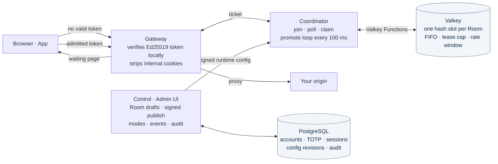

# NudgeOn Waiting Room

<p align="center">
  <a href="https://github.com/NudgeOn/Waiting-Room/actions/workflows/m0.yml"></a>
  <a href="LICENSE"></a>
  
  
</p>

<p align="center">
  
</p>

<p align="center">
  <b>English</b> · <a href="README.ko.md">한국어</a>
</p>

**NudgeOn Waiting Room is an open-source, self-hosted virtual waiting room for websites and apps.**

Put it in front of your existing site or API. When traffic spikes for a flash sale, ticket drop, or signup opening, visitors are held in a strict first-in-first-out queue and admitted at a rate you control. Your origin never sees more than it can handle, and operators run the queue from an admin screen instead of a terminal. Apache-2.0, no external telemetry.

> ⚠️ **Preview, not Beta.** The queue core, admission tokens, admin authentication (TOTP, recovery codes, RBAC) and a persistent local Docker Control plane exist and pass their tests. Production Gateway, failure recovery, the full operator dashboard, install wizard and 10K/100K qualification are unfinished. Every delivery gate in the [main PRD](docs/main-prd.md) is still **NO-GO**. Do not put this in front of real traffic yet.

## What it does today

- **Strict FIFO queue** with a capacity lease cap and a rolling 60-second admission rate, decided atomically inside a single Valkey Function.
- **Browser and app integration**: cookie + 303 redirect flow for websites, JSON `join → poll → claim` API for apps, shared return key across both.
- **Signed admission tokens** (Ed25519) verified locally by the Gateway; raw tickets are never stored.
- **Fail-closed by default**: no signed config, no primary, or an inconsistent store means visitors wait, not bypass.
- **Admin authentication** with Argon2id passwords, RFC 6238 TOTP, single-use recovery codes, `__Host-` session cookies, Origin-pinned CSRF and Admin/Operator/Viewer roles.
- **Persistent local Control plane** on Docker: first-admin bootstrap, Room drafts, signed publish, AUTO/HOLD/safe-drain, one-off events and an audit log that survives restarts.
- **Install planner CLI** (`wrctl plan`, `wrctl estimate`, `wrctl preview`) for offline 10K/100K profile validation and cost comparison.
- **`calm` visitor page**: a built-in, brandable waiting screen (Korean/English) that keeps a visitor's place across refreshes.

<p align="center">
  
</p>

## How it works



- **Visitor states** are `WAITING → READY → ADMITTED`. The 10K/100K numbers are a hard cap on the sum of those states per installation, not a count of TCP connections.
- **Modes** are `OFF` (pass through), `AUTO` (admit within cap and rate), `HOLD` (existing admissions pass, no new promotions), plus internal `DRAINING` and `RECOVERY_HOLD`.
- **Trust boundary**: the Gateway trusts nothing from the outside. Waiting Room headers and cookies from the client are stripped, and the origin only ever receives requests carrying a valid admission.

## Quick start

Requirements: Go 1.26.1, Node.js 22.12+, Docker Compose.

**Persistent local Control (admin, TOTP, Room drafts, audit)** — see the [local Docker guide](docs/local-docker.md):

```sh
npm ci --ignore-scripts
node scripts/local-beta.mjs build
node scripts/local-beta.mjs init on      # 'on' = TOTP required for admins
node scripts/local-beta.mjs up
node scripts/local-beta.mjs bootstrap    # one-time setup token, 15 minutes
node scripts/local-beta.mjs setup        # opens https://127.0.0.1:19444/setup
```

Then log in at `https://127.0.0.1:19443`. TLS is a local self-signed certificate.

**Queue lab (20 visitors, 3 admitted, 17 waiting)** — see the [local lab guide](docs/operators/local-lab.md):

```sh
make lab-valkey        # dedicated Valkey on 127.0.0.1:16379
make lab-quick         # app JSON journey
make lab               # browser journey: open http://127.0.0.1:18080/shop
```

**Install planner (no database, no writes)**:

```sh
make preview           # http://127.0.0.1:18770/install-preview
go run ./cmd/wrctl plan --help
```

**Checks**:

```sh
make check             # gofmt, vet, unit tests, docs, OpenAPI lint, contracts
make test-unit PRD=02  # one sub-PRD's suite
```

## Repository layout

```
cmd/
  wr-control/      persistent local Control plane (admin API, signed publish)
  wr-node/         Gateway / Coordinator / demo-origin roles for the Docker runtime
  wr-lab/          in-process queue lab
  wr-process-lab/  multi-process Gateway + Coordinator lab
  wr-admin-lab/    disposable admin UI lab over loopback TLS
  wrctl/           install planner, cost estimate, clock diagnostic
internal/
  queue/model      single-threaded reference model and randomized invariants
  queue/valkeystore Valkey Functions store (runtime_v3.lua)
  admission/       Ed25519 admission tokens
  waiting/         template registry and the calm visitor page
  adminauth/       Argon2id, TOTP, recovery, sessions, CSRF, RBAC, PostgreSQL store
  localcontrol/    installation state, migrations, identity, signed config
  runtimeplane/    Gateway and Coordinator HTTP roles
  configtrust/     signed configuration verification
  installplan/     10K/100K profile validation, preflight, preview
apps/admin/        React admin UI
api/openapi/       public and admin API contracts
deploy/            Docker Compose files and the Control Dockerfile
docs/              PRDs, ADRs, threat model, operator guides, evidence bundles
test/              contract, browser and schema tests
```

## Roadmap

| Milestone | Goal | Status |
|---|---|---|
| M0 | Contracts, threat model, test skeleton | ✅ Done |
| M1 | FIFO walking skeleton on Valkey, app and browser labs | 🟡 Partial |
| M2 | Safe Gateway alpha: fail-closed, last-known-good config | 🟡 Partial |
| M3 | Operable Beta: admin UX, TOTP/RBAC, scheduling, audit | 🟡 In progress |
| M4 | Standard 10K release candidate on Docker Compose | ⬜ |
| M5 | High Scale 100K release candidate on Helm | ⬜ |
| M6 | v1.0 GA | ⬜ |

v1 is single-region FIFO only. Lottery, priority and weighted policies are reserved in the algorithm registry for later without an API redesign. Multi-region, official mobile SDKs, CAPTCHA and a hosted SaaS are out of scope for v1.

## Documentation

- [Main PRD and release gates](docs/main-prd.md) — start here; each `docs/sub-prd_0x.md` owns one area.
- [Beta plan](docs/beta-plan.md) and [development log](docs/evidence/beta-development.md)
- [Threat model](docs/security/threat-model.md) and [failure matrix](docs/security/failure-matrix.md)
- [Architecture decisions](docs/adr/)
- [Operator guides](docs/operators/) — labs, install planner, cost estimate, clock diagnostic
- [Visitor template guide](docs/design/calm.md)
- [Evidence bundles](docs/evidence/) — every PASS in the PRDs points at a raw log here. A passing unit test never qualifies the product for production.

## Part of NudgeOn

NudgeOn Waiting Room is a standalone product in the [NudgeOn](https://github.com/NudgeOn/nudgeon-platform) family. It shares the brand and the "start with a wizard, run it on your own infrastructure" promise with the NudgeOn customer-engagement platform, but installs and runs independently. You do not need the messaging platform to use the waiting room.

## Contributing and security

See [CONTRIBUTING.md](CONTRIBUTING.md) and [CODE_OF_CONDUCT.md](CODE_OF_CONDUCT.md). Report vulnerabilities as described in [SECURITY.md](SECURITY.md); please do not open public issues for security reports.

## License

[Apache-2.0](LICENSE). Third-party notices are in [NOTICE](NOTICE).
