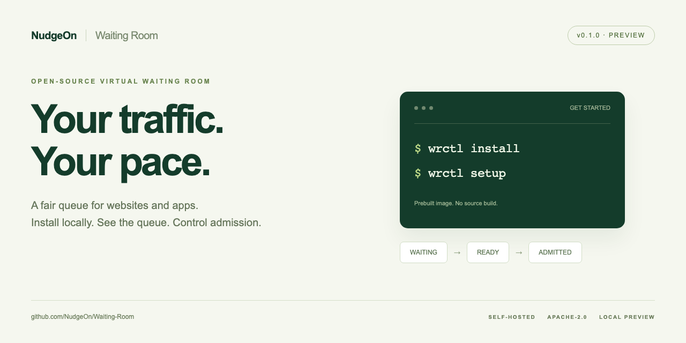
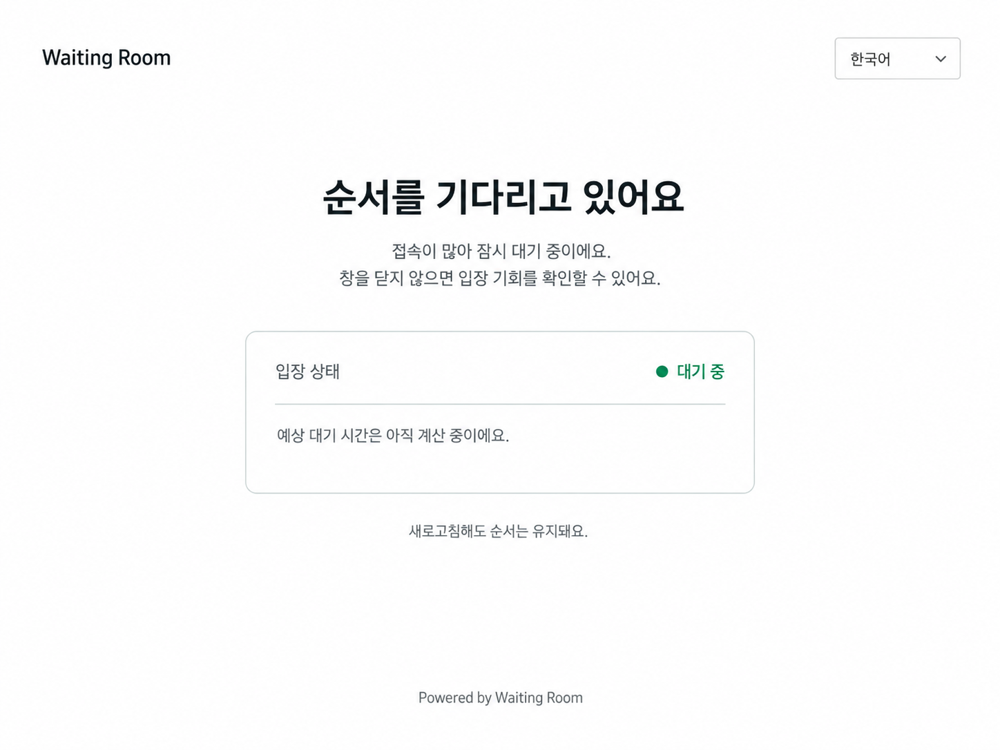
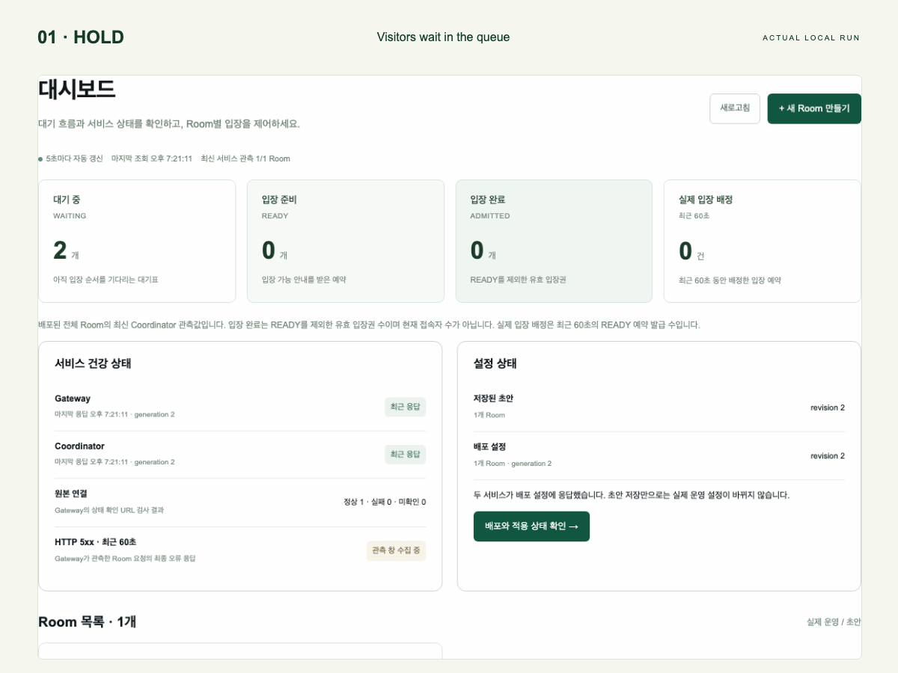

# NudgeOn Waiting Room

<p align="center">
  <a href="https://github.com/NudgeOn/Waiting-Room/actions/workflows/m0.yml"></a>
  <a href="LICENSE"></a>
  
  
</p>

<p align="center">
  
</p>

<p align="center">
  <b>English</b> · <a href="README.ko.md">한국어</a>
</p>

**NudgeOn Waiting Room is an open-source, self-hosted virtual waiting room for websites and apps.**

Put it in front of your existing site or API. When traffic spikes for a flash sale, ticket drop, or signup opening, visitors are held in a strict first-in-first-out queue and admitted at a rate you control. Operators can adjust admission to the origin from an admin screen instead of a terminal. Apache-2.0, no external telemetry.

> ⚠️ **Preview, not Beta.** Local Docker now includes isolated Gateway/Coordinator/Control roles, signed configuration delivery, Web/App admission, operator controls, TOTP policy changes and real Valkey restart recovery. The dashboard, route-addressable Room workspace and five-step draft wizard have [local browser and Docker test evidence](docs/evidence/admin-workspace-summary.md), alongside fresh installation, state-preserving upgrades and scheduled HOLD/AUTO/drain flows. [Read-only URL rule diagnosis](docs/evidence/admin-route-check-summary.md) now checks saved drafts or published snapshots without contacting the target. The downloadable CLI now provides a local prebuilt install/upgrade path. The current source candidate adds the setup/apply wizard, Quick 20/Smoke 1K Traffic Lab, command retry/audit checks and local recovery tools. Production installation, remaining acceptance and 10K/100K qualification are unfinished. Follow the [Beta checklist](docs/beta-plan.md) and [verified progress](docs/evidence/beta-runtime-progress.md); the [main PRD](docs/main-prd.md) delivery gates remain **NO-GO**. Do not put this in front of real traffic yet.

## What it does today

- **Strict FIFO queue** with a capacity lease cap and a rolling 60-second admission rate, decided atomically inside a single Valkey Function.
- **Browser and app integration**: cookie + 303 redirect flow for websites, JSON `join → poll → claim` API for apps, shared return key across both.
- **Signed admission tokens** (Ed25519) verified locally by the Gateway; raw tickets are never stored.
- **Fail-closed by default**: no signed config, no primary, or an inconsistent store means visitors wait, not bypass.
- **Admin authentication** with Argon2id passwords, RFC 6238 TOTP, single-use recovery codes, `__Host-` session cookies, Origin-pinned CSRF and Admin/Operator/Viewer roles.
- **Persistent local Control plane** on Docker: first-admin bootstrap, Room drafts, signed publish, AUTO/HOLD/safe-drain, one-off events and an audit log that survives restarts.
- **Prebuilt local installation**: `wrctl install`, `wrctl setup`, `wrctl up`, and state-preserving `wrctl upgrade`, using a GHCR runtime pinned by digest.
- **Operations dashboard**: WAITING / READY / ADMITTED, actual admission reservations, origin health, recent Gateway HTTP 5xx errors, and direct HOLD/AUTO control.
- **Guided planning**: six steps for scale, environment, capacity, security, review and optional cost; five steps for a Room draft with field validation and waiting-page preview.
- **`calm` visitor page**: a built-in, brandable waiting screen (Korean/English) that keeps a visitor's place across refreshes.

Admin **Traffic Lab** runs Quick 20 and Smoke 1K against a fixed sample origin. [Usage and limits](docs/operators/traffic-lab.md): local correctness checks only; no production URL or profile qualification.

<p align="center">
  
</p>



Actual states captured during a local Docker run: HOLD → AUTO → ADMITTED. These are a small functional demo, not a load benchmark.

## How it works


- **Main path**: Browser or app → Gateway → Coordinator → Valkey. A visitor moves `WAITING → READY → ADMITTED`; the Coordinator promotes the head of the queue every 100 ms within the lease cap and the rolling 60-second rate, all decided atomically in one Valkey Function.
- **Admitted requests** carry an Ed25519 token that the Gateway verifies locally, then proxies to your origin without touching Valkey. Waiting Room headers and `__Host-wr` cookies from the client are stripped first, so the origin only ever sees requests with a valid admission.
- **Trust boundaries**: external visitors / public edge (Gateway) / internal plane (Coordinator, Valkey, Control, PostgreSQL on a private Docker network with per-role mTLS identities) / customer origin / loopback-only admin.
- **Control plane**: the admin UI talks to Control over HTTPS with session cookies, TOTP and CSRF tokens. Control writes accounts, sessions, config revisions and audit rows to PostgreSQL in single transactions and publishes runtime config only as an Ed25519-signed snapshot. Gateway and Coordinator refuse to serve without one.
- **Modes** are `OFF` (pass through), `AUTO` (admit within cap and rate), `HOLD` (existing admissions pass, no new promotions), plus internal `DRAINING` and `RECOVERY_HOLD`. The 10K/100K numbers are a hard cap on `WAITING + READY + ADMITTED` per installation, not a count of TCP connections.
- **Interactive version**: open [`docs/architecture/runtime-architecture.html`](docs/architecture/runtime-architecture.html) in a browser for search, path tracing, source links into the code, dark mode and PNG/SVG export. The diagram is generated from [`runtime-architecture.json`](docs/architecture/runtime-architecture.json), whose source references are verified against the repository at render time.

## Quick start

Download the CLI for your OS and CPU from [v0.1.0-preview.1](https://github.com/NudgeOn/Waiting-Room/releases/tag/v0.1.0-preview.1), check `SHA256SUMS`, and extract it. **Docker with Compose is the only runtime prerequisite**; no Go, Node.js, or repository clone is needed.

```sh
./wrctl install         # pull the pinned GHCR image and start the local stack
./wrctl setup           # private first-admin token + local setup tunnel
```

With a runtime containing the new [setup wizard](docs/operators/setup-wizard.md), review and apply installation settings and measured password calibration before registering the first administrator. Complete authenticator registration, then open `https://127.0.0.1:19443`. The visitor Gateway is `https://127.0.0.1:20443`. TLS is local and self-signed. This Preview binds to loopback and includes a demo origin.

```sh
./wrctl status
./wrctl stop
./wrctl up
# After downloading a newer CLI, back up the installation, then:
./wrctl upgrade
```

Upgrade involves downtime and retains existing volumes, keys, accounts and settings. On a migration failure, retry the recorded upgrade; automatic rollback is not supported by the public Preview. The current source candidate adds verified cold backups and explicit v3/v4 → v5 migration; see [recovery and upgrade](docs/operators/recovery-upgrade.md) for version requirements and restoration into a new installation. See the [downloaded CLI guide](docs/releases/quick-start.md) and [local Docker guide](docs/local-docker.md). macOS binaries are unsigned and not notarized.

Developing from source requires Go 1.26.8 and Node.js 22.12+:

```sh
npm ci --ignore-scripts
node scripts/local-beta.mjs build
node scripts/local-beta.mjs init on
node scripts/local-beta.mjs up
node scripts/local-beta.mjs bootstrap
node scripts/local-beta.mjs setup
```

**Queue lab (20 visitors, 3 admitted, 17 waiting)** — see the [local lab guide](docs/operators/local-lab.md):

```sh
make lab-valkey        # dedicated Valkey on 127.0.0.1:16379
make lab-quick         # app JSON journey
make lab               # browser journey: open http://127.0.0.1:18080/shop
```

**Install planner (no database, no writes)**:

```sh
make preview           # http://127.0.0.1:18770/install-preview
go run ./cmd/wrctl --help
```

**Checks**:

```sh
make check             # gofmt, vet, unit tests, docs, OpenAPI lint, contracts
make test-unit PRD=02  # one sub-PRD's suite
```

## Repository layout

```
cmd/
  wr-control/      persistent local Control plane (admin API, signed publish)
  wr-node/         Gateway / Coordinator / demo-origin roles for the Docker runtime
  wr-lab/          in-process queue lab
  wr-process-lab/  multi-process Gateway + Coordinator lab
  wr-admin-lab/    disposable admin UI lab over loopback TLS
  wrctl/           install planner, cost estimate, clock diagnostic
internal/
  queue/model      single-threaded reference model and randomized invariants
  queue/valkeystore Valkey Functions store (runtime_v3.lua)
  admission/       Ed25519 admission tokens
  waiting/         template registry and the calm visitor page
  adminauth/       Argon2id, TOTP, recovery, sessions, CSRF, RBAC, PostgreSQL store
  localcontrol/    installation state, migrations, identity, signed config
  runtimeplane/    Gateway and Coordinator HTTP roles
  configtrust/     signed configuration verification
  installplan/     10K/100K profile validation, preflight, preview
apps/admin/        React admin UI
api/openapi/       public and admin API contracts
deploy/            Docker Compose files and the Control Dockerfile
docs/              PRDs, ADRs, threat model, operator guides, evidence bundles
test/              contract, browser and schema tests
```

## Roadmap

Updated **2026-09-10**. Current target: **M3 — local Docker Beta**.
M1 is complete within its local walking-skeleton exit criteria. Beta release approval remains **NO-GO**.

| Milestone | Goal | Status | Verified progress / remaining gate |
|---|---|---|---|
| M0 | Contracts, threat model, test skeleton | ✅ Foundation GO | Contracts and executable test skeleton recorded; later delivery gates remain separate. |
| M1 | FIFO walking skeleton on Valkey, app and browser labs | ✅ Local skeleton complete | Five-seed model/Valkey command traces, two-Gateway mixed Web/App Quick 20, race tests, FIFO admission and restart/replay preservation pass. Production/HA acceptance belongs to later gates. |
| M2 | Safe Gateway alpha: fail-closed, last-known-good config | 🟡 Safety implemented; final failure review | Signed config and both-role ACKs, Control-outage LKG, 488 public mode/fault cases, mTLS role boundaries, key rotation and cold restore pass in the recorded candidates. Clock-quarantine recovery and bounded expiry cleanup are implemented. Intermittent write deadlines and acceptance of the latest complete image remain. |
| M3 | Operable Beta: admin UX, TOTP/RBAC, scheduling, audit | 🟡 Core implemented; Beta acceptance pending | Setup calibration/apply, Room wizard and logo sanitization, TOTP/RBAC, scheduling, command retry/audit, Quick 20 and Smoke 1K are connected. Recorded runtime checks cover 81 role/browser pages and 32 API contracts. Latest-image population/recovery evidence, operator usability acceptance and B6 review remain. VoiceOver is excluded at the user's request. |
| M4 | Standard 10K release candidate on Docker Compose | ⬜ Qualification pending | Local installation, upgrade and cold backups are implemented. Population-boundary checks are distinct from the three required sustained 10K qualification runs, which remain incomplete. |
| M5 | High Scale 100K release candidate on Helm | ⬜ Planned | Helm/HA failure tests, repeated 100K qualification and soak remain. |
| M6 | v1.0 GA | ⬜ Planned | Requires every sub-PRD GO and all main-PRD final tests PASS. |

Latest evidence: [2026-09-10 candidate results and remaining blockers](docs/evidence/beta-20260910-logo-maintenance.md).
Earlier evidence: [runtime and recovery](docs/evidence/beta-runtime-progress.md),
[workspace / installation](docs/evidence/admin-workspace-summary.md),
[URL diagnosis](docs/evidence/admin-route-check-summary.md).
The status badge changes from `preview` to `beta` only after the [B6 release review](docs/beta-plan.md) records **GO**.

v1 is single-region FIFO only. Lottery, priority and weighted policies are reserved in the algorithm registry for later without an API redesign. Multi-region, official mobile SDKs, CAPTCHA and a hosted SaaS are out of scope for v1.

## Documentation

- [Main PRD and release gates](docs/main-prd.md) — start here; each `docs/sub-prd_0x.md` owns one area.
- [Beta plan](docs/beta-plan.md) and [development log](docs/evidence/beta-development.md)
- [Threat model](docs/security/threat-model.md) and [failure matrix](docs/security/failure-matrix.md)
- [Architecture decisions](docs/adr/)
- [Operator guides](docs/operators/) — labs, install planner, cost estimate, clock diagnostic
- [Visitor template guide](docs/design/calm.md)
- [Evidence bundles](docs/evidence/) — every PASS in the PRDs points at a raw log here. A passing unit test never qualifies the product for production.

## Part of NudgeOn

NudgeOn Waiting Room is a standalone product in the [NudgeOn](https://github.com/NudgeOn/nudgeon-platform) family. It shares the brand and the "start with a wizard, run it on your own infrastructure" promise with the NudgeOn customer-engagement platform, but installs and runs independently. You do not need the messaging platform to use the waiting room.

## Contributing and security

See [CONTRIBUTING.md](CONTRIBUTING.md) and [CODE_OF_CONDUCT.md](CODE_OF_CONDUCT.md). Report vulnerabilities as described in [SECURITY.md](SECURITY.md); please do not open public issues for security reports.

## License

[Apache-2.0](LICENSE). Third-party notices are in [NOTICE](NOTICE).
