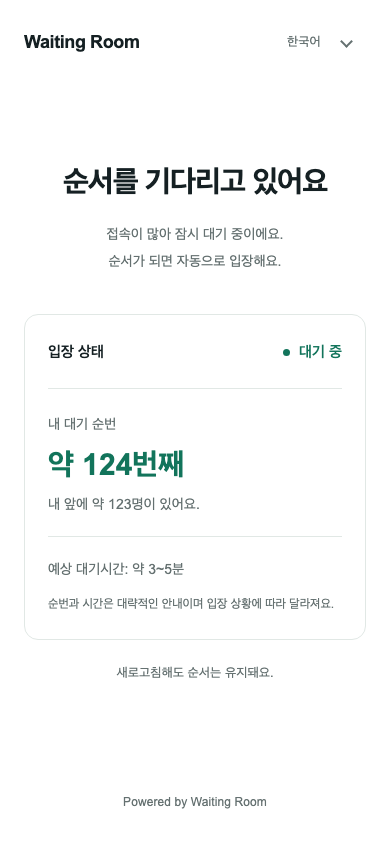
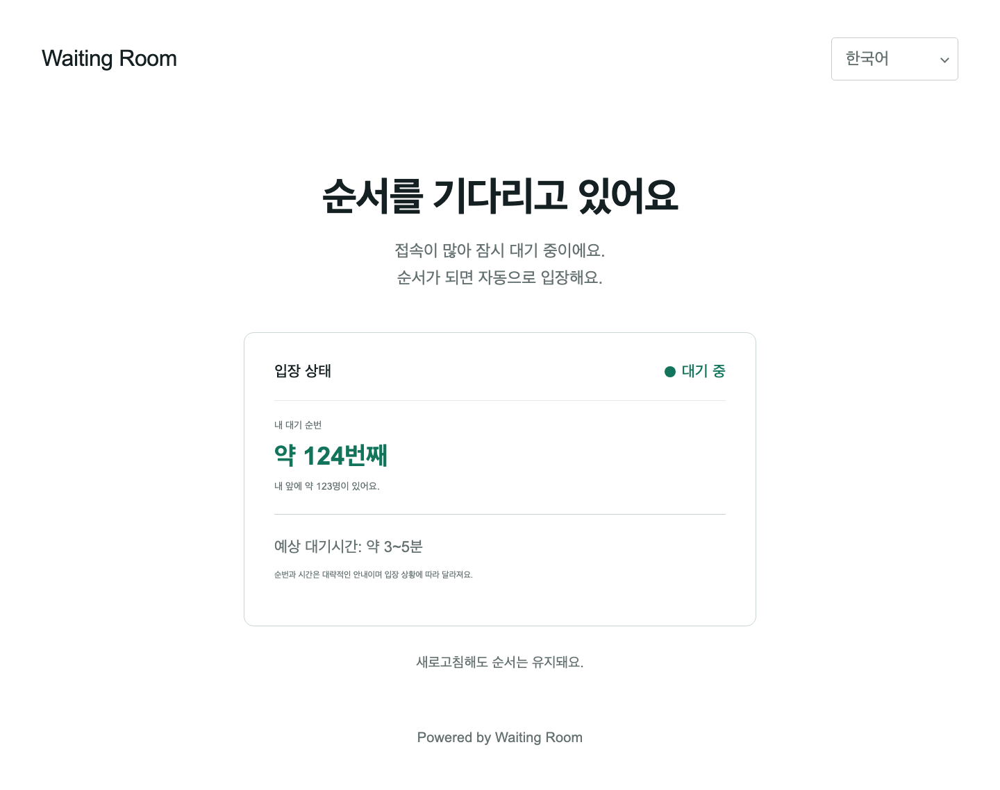

# 2026-09-12 — 페이지 연결·대기 순번 후보 검증

현재 판정: **동일 후보의 로컬 기술 재검증 PASS · Beta 최종 B6 NO-GO**. 실제 운영자 수용 결과는 아직
확보하지 못했다. 이 문서는 자동 검사를 운영자의 최초 과제 수행 결과로 대신하지 않는다.
이전 고정 이미지의 수용 결과는 [2026-09-10 기록](../beta-20260910-m2-latency.md)을 따른다.

## 후보 식별과 기능

고정 이미지 `waiting-room-beta-20260912:local`의 ID는
`sha256:2668fa47958e75095a53f8b71c101d15c373539fae79e8012ba6aeec49b4416b`다.
기준 커밋은 `2b2835662314fd1fa5acb54b10a5382051df4837`이며, 페이지 연결·대기 진행
기능을 더한 **검증 당시의 미커밋 작업 소스**로 빌드했다. 공개 릴리스나 새 CI 통과 커밋으로 표시하지 않는다.
[후보 식별](candidate-identity.json)은 Linux arm64의 실제
이미지 바이너리 두 개와 로컬 빌드 SHA-256 일치, Go 빌드 정보와 서비스 파일별 hash를 보존한다.
검사기와 문서 수정은 서비스 소스 digest에서 제외한다.

- 보호할 HTTPS 페이지에서 원본·보호 경로·상태 확인 주소를 채우고 대기실 서브도메인을
  기본으로 제안한다. 다른 대기실 호스트를 직접 지정할 수 있다.
- 새 Room의 입장권 TTL은 60초, 예상시간 표시는 기본 켜짐이다. 기존 Room 설정은 유지한다.
- 상태 조회에서 읽기 전용 실제 순위와 최근 입장 속도에 따른 예상시간 범위를 제공한다.
  최초 join의 저장된 재시도 응답, TTL, 입장 판정과 저장 스키마는 변경하지 않는다.
- HOLD에서는 시간을 약속하지 않고 입장 재개 대기를 안내한다. 자세한 동작과 DNS·HTTPS·
  reverse proxy의 범위는 [페이지 연결·대기 안내](../../operators/page-and-wait-progress.md)를 따른다.

## 실행 결과

| 검사 | 현재 결과 |
| --- | --- |
| 소스 `make check`, UI 단위 검사 | [PASS](source-check.log), [UI 50개](wizard-unit.log) |
| 전체 Valkey/Lab/publicguard/trafficlab/runtimeplane race 통합 검사 | [PASS, 최상위 117개](runtime-integration.log) |
| 관리자 Room·설치 브라우저 | [PASS, 9개](admin-browser.log) |
| 방문자 브라우저 전체 | [PASS, 39개](visitor-browser.log) |
| Docker 운영 화면·API·Traffic Lab·Control LKG·키 교체 | [PASS, 81개 화면·32개 API](operations.log) |
| 실제 HTTPS 순번·HOLD 안내·모바일·Valkey pause·키 수명 주기 | [PASS](public-keys.log) |
| 488개 확장 공개 장애 조합·mTLS 복구 프로토콜 | [PASS](public-matrix.log) |
| 1K/2K/5K/10K 인원·콜드 보존·AUTO 예상시간 | [PASS](population-cold.log), 실제 콜드 안전 대기 165,421ms |
| 기존 커밋 설치 → 새 후보 업그레이드·기본 콜드 복원 | [PASS](baseline-upgrade-backup.log) |
| 키 교체 이후 세 번째 콜드 복원 | [PASS](upgrade-backup-keys.log) |
| 실제 60분 30초 새 epoch 전체 여정 | [PASS](full-epoch.log), 122회 관측·재로그인·AUTO·epoch 2 원본 도달 |
| 의존성 보안 | [호출 코드 0건·가져온 패키지 0건, npm audit 0건](security.log) |
| 실제 운영자의 도움 없는 과제 수행·용어 이해 | 결과 미확보, B6 대기 |

govulncheck는 요구 모듈에서 호출되지 않는 취약점 1건도 보고했다.
모든 의존 모듈에 취약점이 없다고 확대하지 않는다.

[실제 모바일 화면](waiting-mobile.png)은 서명 배포된 Room의
순번·앞사람 수·HOLD 안내를 실제 Gateway/Coordinator 상태 조회에서 렌더링한 결과다.
Valkey pause 복구는 조회 일정 대기를 포함해 16,590ms였고 기존 fence와 대기표를 유지했다.
백업 원본은 [별도 커밋 빌드](baseline-build.log)이며,
50,032,128바이트의 일관된 7개 정지 볼륨을 새 볼륨에 복원했다.

인원 구간별 생성·전원 상태 조회·최근 100개 동일 재시도는 68.1/133.2/412.3/793.5초였다.
서버의 `Retry-After`를 지킨 429는 27,657건, 성공한 heartbeat는 47,878건이다.
1만 명 콜드 복구 뒤 100개 join 재시도가 모두 보존 기간 안의 동일 응답이었으며,
만료 예외 분기는 0건이었다. AUTO 뒤 실제 HTTPS 순번과 양수의 예상시간 범위,
최초 일곱 명의 FIFO claim·mTLS 샘플 원본 도달이 PASS다.
이 시간은 클라이언트의 요청 제한 대기를 포함하며 순수 서버 지연이나 지속 처리량이 아니다.

## 실행 환경과 시작 실패

전용 Colima `waiting-room` Docker context, 4 CPU·6 GiB VM에서 실행했다.
각 검사는 별도 Compose 프로젝트와 대체 loopback 포트를 사용하며 기존 사용자 설치를
중단하지 않는다. 종료된 시험의 볼륨과 비밀정보는 `.cache/beta-fixtures`에 보존하고
공개 증거에는 토큰·비밀번호·개별 방문자 응답·백업 원본을 포함하지 않는다.

첫 운영 검사에서는 기본 macOS 임시 디렉터리를 사용하는 fixture가 Compose 시작에서
실패했다. 그 디렉터리는 Colima 기본 공유 범위에 없었고, 이후 프로젝트 안의 비공개
디렉터리를 `TMPDIR`로 지정한 실행은 통과했다.
[최초 로그](operations-startup-failed.log)는 별도로 보존한다.

첫 인원 검사는 `waiting-room-beta-tiers-877d0531`에서 Control/Gateway/Coordinator
기동 중 실패했으며 방문자 생성 전이다. 당시 Compose stderr를 기록하지 않아 원인은
확정하지 못했다. [최초 실패](population-startup-failed.log)를 보존한다.
같은 시험 볼륨의 재기동은 여섯 서비스 모두 healthy였고, 볼륨을 보존한 채
시험 컨테이너·네트워크만 종료했다. 후속 검사기는 원문 자격증명을 노출하지 않는
시작 실패 분류를 기록한다. 재실행 통과를 최초 실패의 원인 규명으로 대체하지 않는다.

## 재현 명령

Go·Node·Docker·Playwright를 준비하고 저장소 루트에서 실행한다. macOS에서는 Docker VM에
공유되는 경로를 사용해야 한다. 아래 환경은 이 작업공간에서 준비한 값을 따른다.

```sh
source .cache/dev-env.sh
mkdir -p .cache/beta-fixtures
chmod 700 .cache/beta-fixtures
export TMPDIR="$PWD/.cache/beta-fixtures"
export WR_TEST_TRAFFIC_DOCKER=local
export WR_TEST_CANDIDATE_IMAGE=waiting-room-beta-20260912:local

WR_OPERATIONS_CHECK=1 WR_TEST_KEYS=1 WR_SYNC_FAULTS=1 \
  node test/localbeta/traffic-runtime.mjs
WR_TEST_KEYS=1 WR_TEST_VALKEY_FAULTS=1 WR_TEST_THEME_LOGO=1 WR_TEST_WAIT_PROGRESS=1 \
  node test/localbeta/public-runtime.mjs
GOOS=linux GOARCH=arm64 CGO_ENABLED=0 go build -trimpath \
  -o build/beta8-clock-probe/probe test/localbeta/clock-probe/main.go
WR_TEST_PUBLIC_FAULT_MATRIX=1 WR_TEST_CLOCK_REFRESH=1 WR_TEST_THEME_LOGO=1 \
  WR_TEST_WAIT_PROGRESS=1 node test/localbeta/public-runtime.mjs
WR_TEST_PUBLIC_POPULATION=1 WR_TEST_COLD_POPULATION=1 WR_TEST_WAIT_PROGRESS=1 \
  node test/localbeta/runtime-tiers.mjs
WR_TEST_BACKUP_SOURCE_IMAGE=waiting-room-beta-baseline-2b28356:local \
  WR_TEST_BACKUP_SOURCE_SCHEMA=5 WR_TEST_THEME_LOGO=1 WR_TEST_KEYS=1 \
  node test/localbeta/backup-runtime.mjs
node test/localbeta/epoch-runtime.mjs
```

후보는 다시 빌드하거나 태그를 옮기지 않고 같은 이미지로 검사한다. 백업 원본은 실제
이전 커밋을 별도 디렉터리에서 빌드한 이미지이며 같은 후보의 태그 별칭이 아니다.
공개 키 수명 주기와 확장 matrix는 서로 다른 fixture에서 실행한다.
장시간 epoch 검사는 실제 시간을 기다리며 안전 대기 시간을 줄이지 않는다.
동시 fixture 수는 Docker 네트워크·메모리 여유 범위에서 제한한다.

Production DNS/TLS 연결, 원본 직접 접근 차단, cross-domain 입장권 전달,
10K/100K 지속 부하·HA·GA 판정은 이번 로컬 기능 수용에 포함되지 않는다.


## 화면 캡처 검증

Browser plugin not available. 저장소의 Playwright를 사용했다. 디자인 확인은 실제
현재 대기 페이지 `http://127.0.0.1:18082/shop/design-preview`에서 상태 응답만 예시로
지정했다. 앞사람 123명, 순번 124번째, 예상 3~5분은 실제 운영 인원이 아니다.

| 화면 검사 | 결과 |
| --- | --- |
| 페이지 제목·대기 경로와 실제 콘텐츠 | PASS |
| 숫자 순번·예상시간 범위 렌더링 | PASS |
| 화면 오류 오버레이 | 캡처에서 없음 |
| JavaScript pageerror | 0건 |
| 데스크톱 1440px·모바일 390px·320px | PASS, 모바일 가로 넘침 없음 |
| 기존 Room 주소 입력→기본 서브도메인→직접 호스트→저장/reload | 관리자 브라우저 PASS |

실제 Docker 운영 화면의 콘솔 검사는 통과했다. WebKit 캡처 도구가 주입하는 스타일을
CSP가 막는 알려진 도구 전용 경고와 의도한 HTTP 장애 응답은 앱 오류와 구분한다.
최신 디자인 캡처는 Chromium이며, 기존 방문자 동작 회귀는 세 엔진 39개가 PASS다.





커밋 범위: 별도로 추가되어 있던 Supabase CLI 개발 의존성의 `package.json`과
`package-lock.json` 변경은 이번 기능 커밋에서 제외했다. 후보 식별 파일의 해당 두 hash는
검사 당시 로컬 환경을 기록한 값이며, 기능 커밋의 의존성 파일과 같다고 주장하지 않는다.
