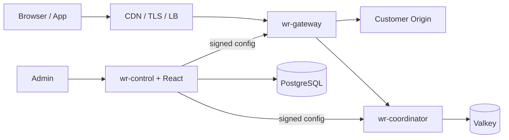

# SUB-PRD-05 — Architecture·Storage·Key·Internal Security

> 읽기 순서: [main-prd.md](main-prd.md) → SUB-PRD-02·03·04 → 이 문서. Process boundary, storage ownership, config trust, secret과 내부 통신의 source of truth다.

## 1. 목표

public Gateway compromise가 database·queue write·token signing으로 곧바로 확장되지 않게 권한을 분리한다. Control 장애에도 유효한 last-known-good config로 처리하고, 신뢰할 config가 없는 cold start는 전체 public traffic을 fail-closed한다.

## 2. Architecture

하나의 Go module에서 production multi-role image와 별도 lab image를 만든다.

| Process | 책임 | 직접 접근 가능 |
|---|---|---|
| `wr-gateway` | reverse proxy, waiting page, public API forwarding, token verify | Coordinator, origin, local signed config |
| `wr-coordinator` | FIFO/runtime Function, READY/claim, admission signing | Valkey |
| `wr-control` | Admin API/UI, config publish, scheduler | PostgreSQL, Coordinator control endpoint |
| `wrctl` | setup/doctor/migrate/backup/restore/benchmark/recover-admin | 명령별 최소 endpoint/secret |
| `wr-lab` | deterministic origin와 logical client | lab environment only |

`wr-lab` binary와 fixture는 production image에 포함하지 않는다.

## 3. Listener와 network boundary

- `public`: Gateway customer traffic와 최소 liveness만 제공
- `admin_private`: Control Admin API/UI, loopback/private bind가 기본
- `metrics_private`: 각 process metrics, public route 없음
- `coordinator_internal`: queue/claim/control의 role-scoped endpoint

Admin·metrics·Coordinator listener를 public Gateway에 route하지 않는다. readiness는 dependency 상태를 반영하지만 public liveness는 process 생존만 노출하고 topology·version·secret 정보를 반환하지 않는다.

Standard Compose는 host에 publish하지 않은 isolated network와 설치별 service credential을 함께 사용한다. High Scale은 workload identity 기반 mTLS, endpoint별 authorization과 NetworkPolicy가 필수다. DNS service name이나 source IP만 신뢰하지 않는다.

## 4. Storage ownership

### A-01 PostgreSQL

- install profile·region ID
- local user·role·Argon2id password hash
- encrypted TOTP secret, recovery hash, session hash, auth policy version/revoke
- Site, Room, route, safe theme, event
- config/runtime revision과 immutable config snapshot
- signing key `kid`, public key와 rotation metadata
- admin idempotency와 redacted audit event

### A-02 Valkey

- Room epoch FIFO sequence/sorted set와 expiry index
- READY reservation와 active admission lease
- rolling 60-second counter
- encrypted public idempotency replay와 source quota
- visitor/idempotency cardinality counter
- primary epoch, fencing, recovery latch와 `unsafeUntil`

v1은 unsharded single writable primary + replicas다. `maxmemory-policy noeviction`을 요구한다. Standard reference는 AOF everysec+RDB이며, 현재 로컬 Docker candidate는 응답한 쓰기 보존을 우선해 AOF always를 사용한다. 이 차이는 별도 처리량 qualification이 필요하다. High Scale reference는 stable-primary, `min-replicas-to-write=1`과 유한한 `min-replicas-max-lag`를 요구한다.

## 5. Secret·key inventory

| Material | 보유 role | 저장 방식·용도 |
|---|---|---|
| Admission Ed25519 private key | Coordinator only | admission token sign |
| Admission public keyring | Gateway, Coordinator | local verify/current `kid` |
| Config signing private key | Control only | canonical snapshot sign |
| Config bootstrap trust/public keyring | Gateway, Coordinator | deployment-pinned verify root |
| TOTP AES-256-GCM master key | Control only | user secret encrypt/decrypt |
| Public-idempotency AEAD key | Coordinator only | exact response encrypt/decrypt |
| Return-URL AEAD current/previous key | Gateway only | same-host sealed return |
| PostgreSQL credential | Control, scoped wrctl | least-privilege DB role |
| Valkey credential | Coordinator, scoped wrctl | runtime commands/functions |
| Service credential/workload cert | calling role | internal endpoint authentication |

Gateway에는 PostgreSQL·Valkey credential과 signing private key를 주지 않는다. Private/master key는 PostgreSQL에 저장하지 않고 deployment secret으로 read-only mount한다. file owner·mode와 Kubernetes Secret/external-secret reference를 manifest에 기록하고 secret value는 plan/log에 넣지 않는다.

## 6. Signed config와 last-known-good

### A-03 Snapshot format

canonical JSON bytes는 schema version, monotonic installation `generation`, config revision, issued/expiry, signer `kid`, complete Site/Room/routes/limits/keyring을 포함한다. 부분 patch를 Gateway에 전파하지 않는다.

Gateway와 Coordinator는 deployment-pinned bootstrap trust로 signature를 확인하고 schema·expiry·generation을 검증한 뒤 atomic file replace와 memory swap을 수행한다. 적용한 generation high-water mark보다 낮은 snapshot은 valid signature여도 거부한다.

Control은 기본 5분마다 refresh하고 snapshot 기본 validity는 24시간이다. Control outage 동안 expiry 전 last-known-good를 사용한다. expiry 뒤에는 OFF를 추측하지 않고 public liveness 외 traffic을 503으로 처리한다.

### A-04 Ack와 rotation

정상 rotation 순서:

1. 새 verify/decrypt key를 모든 active replica에 선배포
2. replica가 keyring generation 저장·사용 가능함을 ack
3. signer/sealer를 새 `kid`로 전환
4. 최대 관련 TTL + 30초와 stale-replica 제거 조건을 모두 기다림
5. 구 key 폐기

config signer는 모든 active Gateway가 새 generation LKG를 저장하기 전 폐기하지 않는다. return AEAD는 최대 ticket absolute TTL, admission key는 최대 admission TTL을 overlap한다.

emergency revoke는 Admin action-bound reauth와 deployment secret 교체를 요구한다. 새 config/epoch를 발행하고 무효화될 visitor state를 감사로그에 기록한다.

## 7. Internal command security

- Gateway credential은 public join/status/claim Coordinator method만 호출 가능하다.
- Control identity는 config/keyring publish와 recovery orchestration만 가능하다.
- wrctl credential은 command마다 별도 scope·짧은 TTL을 사용한다.
- internal request는 installation ID, caller role, nonce/request ID, deadline을 검증한다.
- mTLS/credential failure는 origin bypass로 fallback하지 않는다.
- external client가 보낸 internal header는 SUB-PRD-03에 따라 제거한다.

## 8. Origin·health URL security

- origin hostname과 allowed CIDR/address set을 Admin이 명시한다.
- resolve된 모든 address가 allowlist에 있어야 하고 매 reconnect/re-resolve에서 다시 검사한다.
- cloud metadata, loopback, link-local, Unix socket과 예상하지 않은 private range는 기본 거부한다. loopback은 lab profile만 허용한다.
- redirect를 자동 따라 다른 host로 이동하지 않는다.
- TLS SNI/hostname과 certificate를 검증하고 optional origin mTLS를 지원한다.
- health URL은 origin base와 같은 SSRF/DNS-rebinding policy를 사용한다.
- origin ACL/mTLS active probe가 불가능하면 `unverified`를 유지하며 “origin 우회 차단 완료”로 표시하지 않는다.

## 9. Backup·restore

`wrctl backup`은 consistent PostgreSQL dump와 deployment-secret bundle을 manifest digest로 묶는다. runtime Valkey queue는 backup/restore 대상이 아니다.

secret bundle은 operator recipient public key, KMS wrapping key 또는 TTY passphrase-derived key로 암호화한다. decrypt material은 bundle, shell history, process argument와 log에 넣지 않는다.

restore는 DB/schema/config generation, public-key metadata와 secret `kid` 일치를 검증한다. runtime queue가 없으므로 항상 새 epoch의 RECOVERY_HOLD로 시작하고 기존 ticket/admission을 복원했다고 주장하지 않는다. key bundle이 없거나 manifest가 변조됐으면 normal start를 거부한다.

## 10. Observability

- Prometheus metrics와 structured JSON log는 기본적으로 설치 환경 밖으로 전송하지 않는다.
- request ID, Room public ID, state/result, latency, invariant counter와 revision만 기록한다.
- token, cookie, password/TOTP/recovery, secret, raw IP, full target/return query와 authorization은 redaction한다.
- audit event 의미는 SUB-PRD-04, runtime invariant metric은 SUB-PRD-02가 소유한다.

## 11. Acceptance criteria

- [ ] role마다 허용되지 않은 DB/Valkey/private key가 mount되지 않음
- [ ] public listener에서 Admin/metrics/internal endpoint 접근 불가
- [ ] config tamper·expiry·rollback·torn update가 모두 거부됨
- [ ] cold start에 trustable snapshot이 없으면 liveness 외 전체 503
- [ ] key rotation 중 valid old/new artifact를 허용하고 overlap 뒤 old를 거부
- [ ] 잘못된 internal identity가 queue state를 바꾸지 못함
- [ ] backup wrong key·tamper·missing secret을 normal restore로 수락하지 않음
- [ ] log/metric/backup metadata secret leak 0건

## 12. 구현 Checklist

- [ ] production multi-role와 lab image 분리
- [x] loopback 전용 wr-lab 실행 파일과 앱 role 경계 (동일 process; production isolation 아님)
- [x] `wr-process-lab`: Gateway 2개·Coordinator·origin 별도 PID, role별 private pipe 설정·수명·장애/교체 시험 (same OS user; 운영 격리 아님)
- [x] 별도 wr-admin-lab: 2개 loopback TLS listener·ephemeral cert/key·무작위 auth schema·정상 종료 정리
- [x] M1 내부 service credential·Ed25519 admission·encrypted join token replay
- [x] 로컬 Gateway 전용 ephemeral return AEAD·host/port/ticket/expiry binding
- [x] configtrust 서명·schema/time/generation·LKG FileStore와 process lab role binding/cold-start/expiry 차단 ([범위](operators/signed-config-lab.md))
- [x] runtime config clock의 lock 내부 측정·동시성 unit 및 signed snapshot bounded fuzz ([입력/clock 기록](evidence/input-boundaries-summary.md))
- [ ] listener/address·readiness·liveness matrix
- [ ] role별 non-root user와 secret manifest/mode
- [ ] Compose credential와 High Scale mTLS/NetworkPolicy
- [ ] PostgreSQL migration·least-privilege role
- [ ] Valkey Function load/version/rollback
- [ ] canonical config encoder·signer·verifier·generation high-water
- [ ] keyring distribution ack·rotation·emergency revoke
- [ ] deterministic admission serialization과 return AEAD
- [ ] fencing/recovery latch·unsafeUntil persistence
- [ ] SSRF/DNS-rebinding/origin ACL validator
- [ ] backup manifest·wrapping·restore validation
- [ ] structured redaction과 metrics

## 13. Unit test Checklist와 결과

부분 진입점: `make test-unit PRD=05` — Admin Lab certificate, process lab IPC/role binding, configtrust core/file 단위 시험.
`WR_TEST_VALKEY=127.0.0.1:16379 make test-processes`는 실제 별도 PID 장애·교체 시험이며 전체 UT-05 구현이 아니다.

| UT-ID | Unit/integration test | 기대 결과 | 현재 결과 | Evidence |
|---|---|---|---|---|
| UT-05-01 | role secret/access matrix | forbidden access 전부 실패 | PARTIAL | role별 IPC 필드 거부·private key Coordinator 내부 생성, same-user/무인증 Valkey 접근 차단은 미완료; [process lab](evidence/process-lab-summary.md) |
| UT-05-02 | listener isolation | public Admin/metrics/internal 404/불가 | NOT RUN | — |
| UT-05-03 | service credential/mTLS | wrong role·identity 거부 | NOT RUN | — |
| UT-05-04 | config canonical/signature | byte stability·tamper 거부 | PARTIAL | core deterministic schema·서명·role binding PASS, production schema/publisher 후속; [기록](evidence/signed-config-summary.md) |
| UT-05-05 | generation/expiry/cold start | rollback 거부·liveness 외 503 | PARTIAL | core/file high-water·실제 Gateway/Coordinator expiry/cold 차단 PASS; deployment persistence/refresh/fencing 후속; [기록](evidence/signed-config-summary.md) |
| UT-05-06 | rotation overlap | old/new accept window 정확 | NOT RUN | — |
| UT-05-07 | return AEAD binding | tamper/host/room/expiry 거부 | PARTIAL | lab binding unit·browser tamper PASS; keyring/rotation 후속; [template](evidence/browser-template-summary.md) |
| UT-05-08 | SSRF/DNS rebinding | forbidden address/redirect 거부 | NOT RUN | — |
| UT-05-09 | backup manifest/wrapping | wrong key/tamper/missing bundle 거부 | NOT RUN | — |
| UT-05-10 | restore without runtime | new epoch RECOVERY_HOLD | NOT RUN | — |
| UT-05-11 | log/metric redaction | secret·PII 0 | NOT RUN | — |
| UT-05-12 | scheduler advisory lock | transition 한 번 | NOT RUN | — |

### Unit test 실행 로그

| Run | Commit | Command | Passed/Failed | Result | Evidence |
|---|---|---|---:|---|---|
| — | — | — | — | NOT RUN | 구현 전 |
| M1-local | uncommitted snapshot | `make test-integration`; `make test-persistence` | 부분 suite 결과는 evidence 참조 | PARTIAL | [M1](evidence/m1-summary.md); production isolation/HA 미완료 |
| Admin-UI-local | uncommitted snapshot | `make test-unit PRD=05`; `npm run test:admin-browser` | 최종 집계는 evidence 참조 | PARTIAL | [Admin UI](evidence/admin-ui-summary.md); certificate 1 unit·listener 격리/정리 Chromium, production manifest·role·key 지속성 미완료 |
| Process-lab-local | uncommitted snapshot | runner `process-lab-20260906-final --processes`; `make test-unit PRD=05` | 최종 집계는 evidence 참조 | PARTIAL | [별도 PID·IPC·장애/교체·hash](evidence/process-lab-summary.md) |

### 로컬 Docker 추가 Checklist — 2026-09-06

- [x] 실제 role 분리·signed delivery ACK·mTLS origin Web/App 입장·role 재시작 replay ([62250138](evidence/waiting-room-local-beta-test-62250138.json)).
- [x] Valkey AOF 재생 시 default-off ACL 오류 수정 후 실제 90초 복구 window·기존 WAITING 보존·expired admission 거부.
- [x] 반복 upgrade 정책/계정/초안/key binding 보존 ([6e55a23e](evidence/waiting-room-local-beta-test-6e55a23e.json)); v3 queue 데이터 이행 완료를 뜻하지 않음.
- [x] signed snapshot 5분 refresh·미배포 draft 비포함·clock rollback 거부 PG test PASS (0.714s).
- [x] origin health 100 Room 입력에 동시성 최대 8·취소 후 잔여 probe 생략·Room 순서 보존 unit/race PASS (runtimeplane 1.807s). 전체 probe budget 3초, 네트워크 대기는 Gateway config lock 밖에서 실행.
- [ ] epoch 복구 운영 명령·v3 runtime 이행·key rotation·backup/restore·HA/전체 보안 matrix.

## 14. GO/NO-GO 판정

- 명세의 구현 착수 준비: **GO**
- 현재 delivery 판정: **NO-GO**
- 이유: 로컬 Docker role/storage/mTLS·signed publish·실제 primary restart를 부분 검증했다. rotation/backup/restore/HA와 전체 UT-05 evidence는 아직 없다. [threat model](security/threat-model.md)·[failure matrix](security/failure-matrix.md)·[ADR](adr/0002-state-and-time.md)의 남은 검증이 필요하다.
- M1 추가: [로컬 runtime ADR](adr/0003-m1-local-runtime.md)과 [검증 기록](evidence/m1-summary.md). runtime 일부와 [signed config lab](evidence/signed-config-summary.md)을 검증했지만 durable secrets·production config trust/distribution·mTLS·HA recovery·production PostgreSQL은 미완료다.
- GO 조건: checklist와 unit/integration/security test PASS, SUB-PRD-02·03·04 GO, Critical/P0/P1 0건, reviewer·UTC 시각 기록.

## 15. 참고

- [Valkey Functions](https://valkey.io/topics/functions-intro/)
- [Valkey persistence](https://valkey.io/topics/persistence/)
- [Valkey Sentinel](https://valkey.io/docs/topics/sentinel/)

### 2026-09-09 로컬 키·복원 추가 검증

- [x] Control/Coordinator/Gateway별 개인 키 분리, 공개 keyring digest와 mTLS ACK.
- [x] 전환 전 모든 로컬 signer 정지, 기존 promotion 시각에 따른 동일 claim 서명.
- [x] 최대 24시간 ticket/config TTL +30초 이전 normal retire 거부.
- [x] 최근 Admin action-bound 새 epoch와 양 노드 ACK를 요구하는 긴급 키 폐기.
- [x] 세대별 키 명령 재시도에서 키 재생성·전환 시각 연장·중복 감사 없음.
- [x] 키 회전된 7개 볼륨의 새 프로젝트 콜드 복원, 기존 deadline·ACK·old/new replay 보존.

[실행 기록](evidence/beta-20260909-key-replay.md), [키 운영 절차](operators/key-rotation.md).
TLS CA·TOTP 저장 master·DB credential 교체와 다중 replica/HA는 이 검증에 포함하지 않는다.
